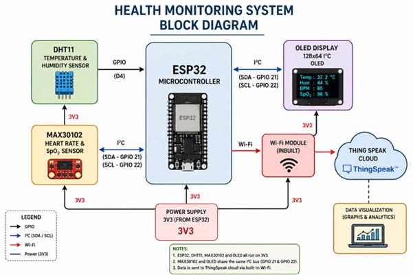
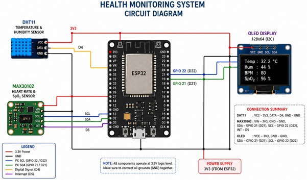
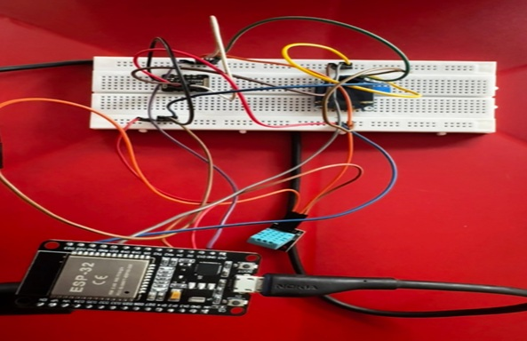
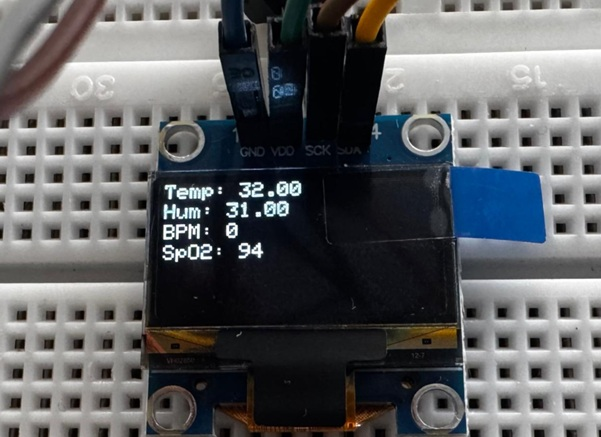
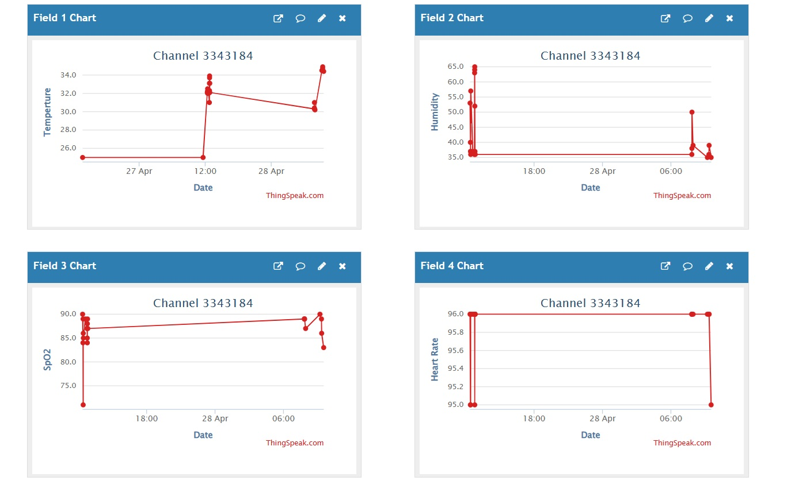

#  IoT-Based Smart Healthcare Monitoring System

A real-time healthcare monitoring system that measures **Heart Rate (BPM), Blood Oxygen Saturation (SpO₂), Temperature, and Humidity** using IoT sensors and transmits the collected data to the cloud for remote monitoring and analysis.

---
## 📂 Repository Contents

- `code/` – ESP32 firmware source code
- `images/` – Architecture diagrams, circuit diagrams, prototype photos, OLED output and dashboard screenshots
- `report/` – Project report and presentation

---
##  Project Overview

This project was developed to provide continuous health monitoring through low-cost IoT devices. Sensor data is collected in real time, displayed locally on an OLED screen, and uploaded to the ThingSpeak cloud platform for remote visualization and analytics.

The system is capable of monitoring:

- ❤️ Heart Rate (BPM)
- 🫁 Blood Oxygen Saturation (SpO₂)
- 🌡 Temperature
- 💧 Humidity

---

##  System Architecture



The system consists of:

1. Sensors collect physiological and environmental data.
2. Microcontroller processes sensor readings.
3. Data is displayed on OLED display.
4. Data is transmitted through Wi-Fi.
5. ThingSpeak cloud stores and visualizes readings.

---

##  Hardware Components

| Component | Purpose |
|------------|----------|
| ESP8266 / NodeMCU | Main Controller |
| MAX30102 | Heart Rate & SpO₂ Sensor |
| DHT11 | Temperature & Humidity Sensor |
| OLED Display | Real-Time Data Display |
| Wi-Fi Module | Cloud Communication |
| Breadboard & Jumper Wires | Circuit Connections |

---

##  Software & Tools

- Arduino IDE
- ThingSpeak Cloud
- Embedded C/C++
- I2C Communication Protocol

---

##  Features

- Real-time health monitoring
- Cloud-based data logging
- OLED display visualization
- Wi-Fi enabled remote access
- Low-cost IoT implementation
- Continuous monitoring capability

---

##  Hardware Setup

### Circuit Setup



### Prototype



---

##  Results

### OLED Display Output



### ThingSpeak Dashboard



---

##  Performance

The system successfully monitored:

- Heart Rate (BPM)
- Blood Oxygen Saturation (SpO₂)
- Temperature
- Humidity

Data was transmitted and visualized in real time using ThingSpeak cloud services.

---

##  Project Structure

```text
Smart-Healthcare-Monitoring-System
│
├── code/
│   └── IOT_in_SmartHealthcare.ino
│
├── images/
│   ├── architecture.png
│   ├── circuit_diagram.png
│   ├── prototype.jpg
│   ├── oled_output.jpg
│   └── thingspeak_dashboard.png
│
├── report/
│   └── IoT_Healthcare_Report.pdf
|   └── IOT in Smart Healthcare PPT.pptx
│
└── README.md
```

---

##  Future Improvements

- Mobile application integration
- AI-based health anomaly detection
- Emergency alert notifications
- Patient history tracking
- Machine learning prediction models

---

##  Author

**Siya Ravichandra Shetty**

B.Tech Electronics & Communication Engineering  
National Institute of Technology Delhi

LinkedIn: www.linkedin.com/in/siya-shetty-381087325/

---

##  Acknowledgements

This project was developed as part of academic exploration in IoT, Embedded Systems, and Healthcare Monitoring technologies.
